# Distributed Charging Station Reservation System & Power Grid Simulation

## 1. Introduction

The aim of this project is to design a distributed system simulating a real world power grid with a focus on a smart system for reserving charging stations for electric vehicles.

Another goal of this project is to maximize the usage of our own renewable energy sources, to do this we implemented a marketplace system where our own energy tries to maximize profits before buying external energy to cover the most essential needs.

Under the hood we have two different contract based systems running, one for the power grid energy transfer (e.g. wind turbines, consumers/households and charging stations) and one for the communication and reservation of charging stations for electric vehicles.

## 2. Use Case Description

The main use case for this simulation is to model how the power grid of the future might look like, considering modern day challenges such as the integration of renewable energy sources, the need for efficient energy distribution, and the growing demand for electric vehicle charging infrastructure that make the power grid more complex and dynamic than ever before.

## 3. System Design

### 3.1 Distributed Coordination Mechanism

#### 3.1.1 Contract-Net Based Approach

**Power Grid Energy Transfer:**

In the power grid energy transfer we work with two factions, the producers (e.g. wind turbines) and the consumers (e.g. households and charging stations). We decided to use a contract-net based approach where consumers can request energy from producers, the producers then accept or reject the requests based on the current demand and supply of energy. 

The most important factor for the producers is the price they can get for their energy, producers rank all available offers purely based on the price, which means that consumers, who are willing to pay more, will get the energy they need first.

**Charging Station Reservation:**

The charging station system works the other way around, here the electric vehicles request charging stations to bid on their own reservation. The vehicle broadcasts a request, saying how much energy it needs and how much it is willing to pay for the reservation. 

The charging stations then respond with their offer, including possibly less than the requested amount of energy, but at a price that is acceptable for them. The vehicle then selects the best offer based on its own criteria (e.g. price, distance, availability) and confirms the reservation. 

#### 3.1.2 Failure Handling Mechanism

The entire system works in a tick-based manner. Each tick represents a time unit of 15 minutes, during which every individual component can update their state and communicate with each other.

All components are designed to deal with this as an relative deadline, meaning that anything that happens after the tick is ignored but the component itself will still be able to process the information it received before the tick ended.

This means that if a component fails it will not deadlock the entire system, but rather at most, halt the processing of any tick that interacts with the failed component for that tick. The system will then continue to operate normally for the next tick, allowing for retries or alternative actions in subsequent ticks.

### 3.2 Decision-Making Logic

#### 3.2.2 Heuristic Approach and Quality Assurance

**Power Grid Energy Transfer:**

Given that producers are primarily driven by price, we implemented a quite simple heuristic where the price directly relates to the importance of the request. If a charger only has 10% of its battery left, it will ask for energy at a price of (1.0 - 0.1), meaning that it is willing to pay 0.9€ for each energy unit it needs. It will also linearly decrease the price for each additional unit of energy it can store, thus if the battery is at 10% it will only ask for one unit at 0.9€ and the next unit at the price of the previous unit minus the amount of energy it would have if that unit was added, so 0.8€ for the second unit if it could store a total of 10 units, and so on.

Households on the other hand are not driven by the price, since we always want to cover them first, and always request energy at a price of 1.0€ per unit, meaning that they will always get the energy they need first.

**Charging Station Reservation:**

Vehicles have a more complex decision-making process, as they need to consider multiple factors such as distance to the station, price, and availability. The heuristic we implemented allows vehicles to prioritize offers based on a weighted score that combines these factors.

- **Distance**: Closer stations receive a higher score.
- **Price**: Lower prices receive a higher score.
- **Amount of Energy**: Stations offering more energy receive a higher score.

If a station has a great price but is far away, it might still be selected if the price difference is significant enough to outweigh the distance penalty.

#### 3.2.3 Environmental Adaptation

If our own renewable energy sources are not enough to cover the demand, we will buy external energy at the market price, which is currently set to 0.9€ per unit. This means that we will always try to cover our own demand first, and only buy external energy if we cannot cover it with our own renewable sources to ensure that no consumer is starved of energy.

## 4. Simulation Model

### 4.1 Simulation Setup

For our simulation, we have a cluster of wind turbines, households, and charging stations. Each component is represented as an agent in the simulation.
- **Wind Turbines**: Generate energy based on wind conditions.
- **Households**: Consume energy and request it from the grid.
- **Charging Stations**: Provide energy to electric vehicles and manage reservations.
- **Electric Vehicles**: Request charging stations and reserve them based on their needs.
- **Fusion Reactor**: External energy source that can be used to cover the demand if our own renewable sources are not enough, which we try to avoid.

There are also additional components for the sake of the simulation, such as a tick generator that generates ticks for the simulation, and a dashboard that visualizes the current state of the system.

### 4.2 Interaction Protocol (e.g., Sequence Diagram)

#### 4.2.1 Power Grid Energy Transfer

#### 4.2.2 Charging Station Reservation

## 6. Evaluation

### 6.1 Evaluation Scenarios

- **Scenario 1**: Normal operation with sufficient renewable energy.
- **Scenario 2**: High demand for charging stations with limited renewable energy.
- **Scenario 3**: Storm breaks turbines

### 6.2 Simulation-Based Evaluation Preparation

For Scenario 1 one we set the consumer demand to a normal level, meaning that the households will consume energy at a normal rate and the charging stations will have a normal amount of requests.

For Scenario 2 we set the consumer demand to a high level, meaning that the households will consume energy at a high rate and the charging stations will have a high amount of requests. We also set the renewable energy sources to a low level, meaning that we will have to buy external energy to cover the demand.

For scenario 3 we have a normal day similar to scenario 1, however, midday a wind storm forces the turbines to go offline at which point power becomes extremely expensive. We expect batteries to dry out over time as charging prices massively increase.

### 6.3 Preliminary Results and Feedback

#### Scenario 1: Ideal Energy Market

##### Best Offer

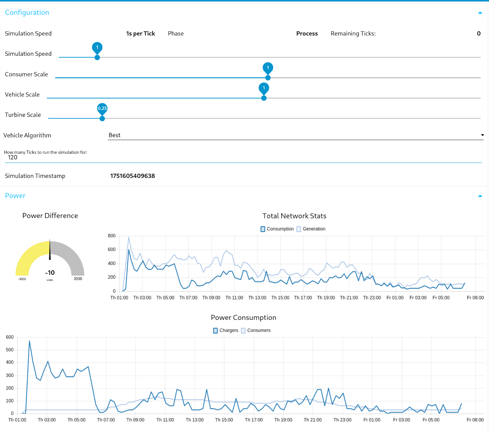
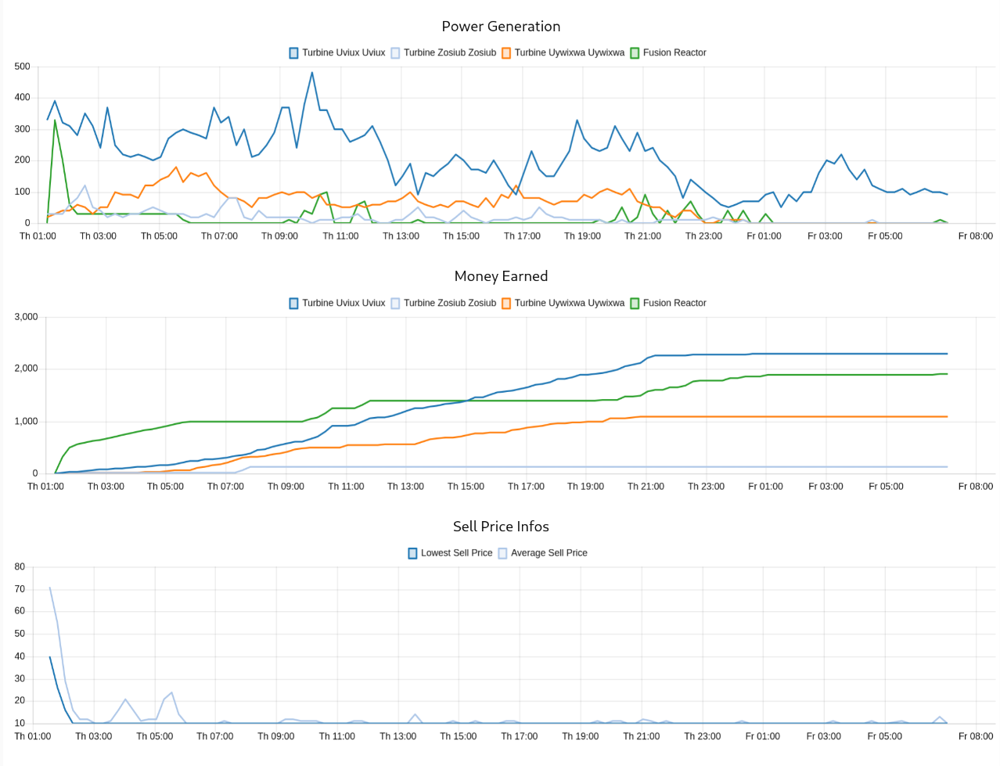
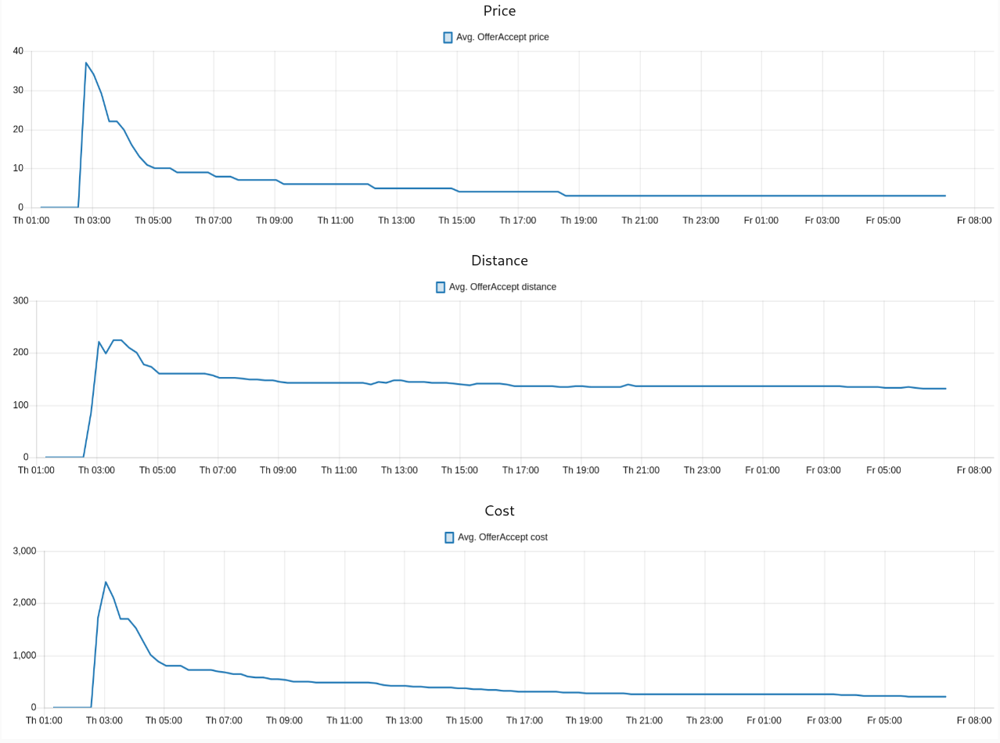
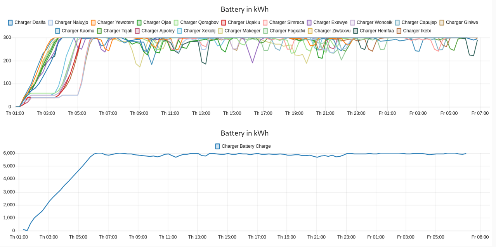

##### Random Offer

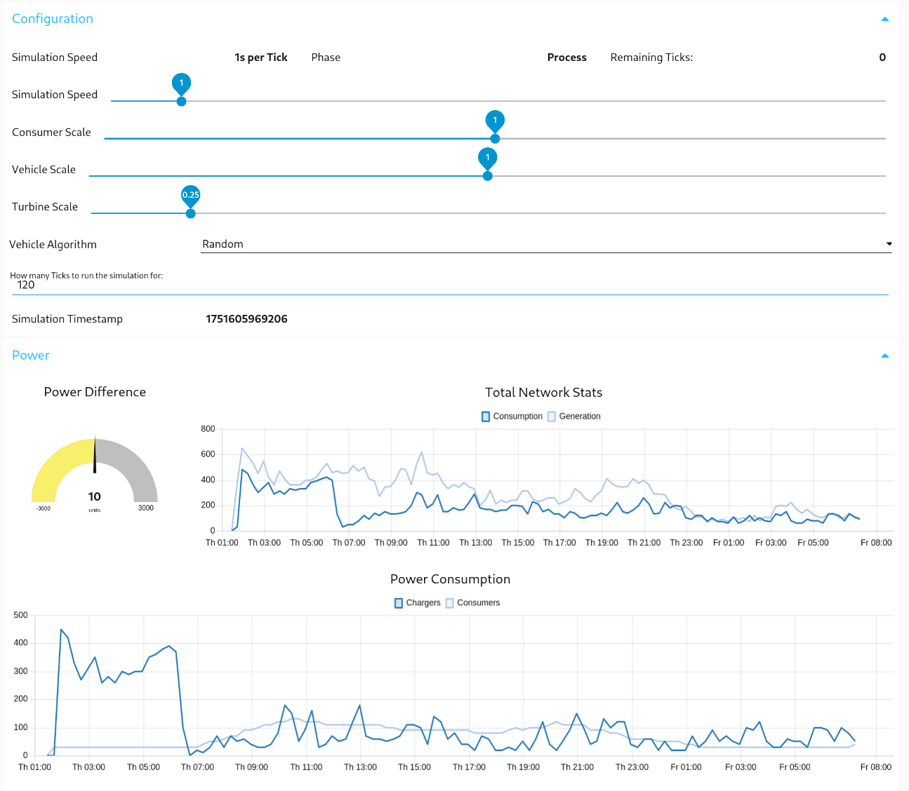
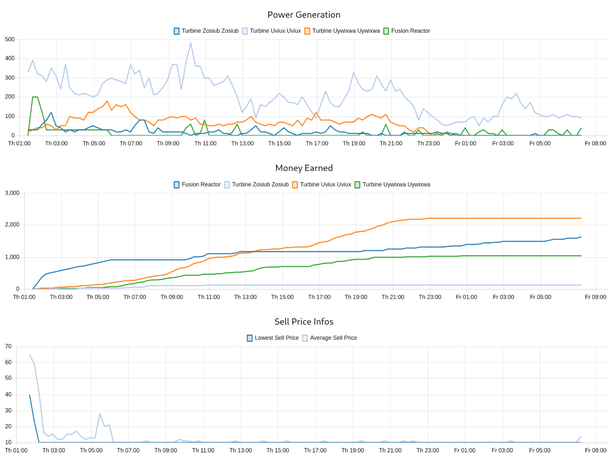
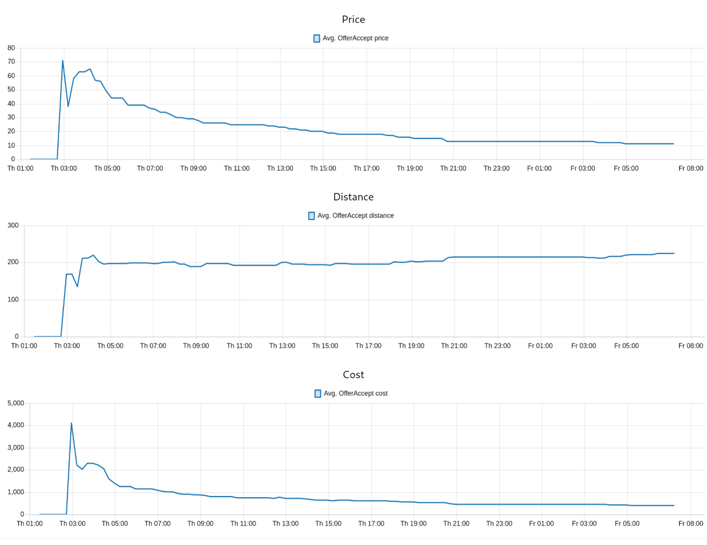
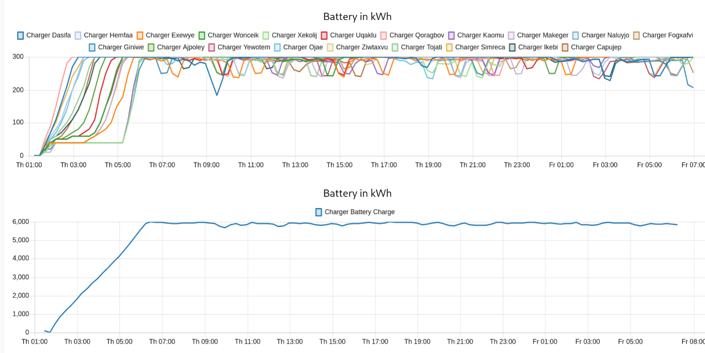

#### Scenario 2: Worst Case Energy Market

##### Best Offer

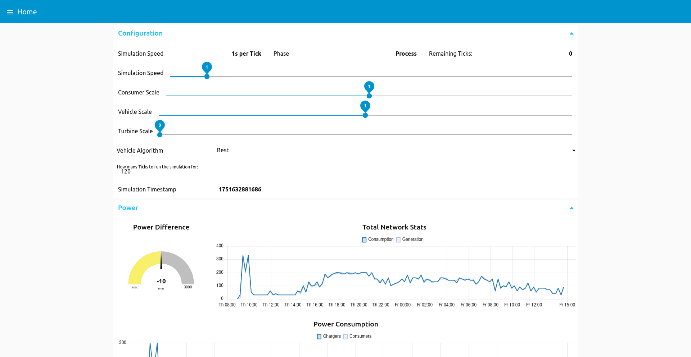
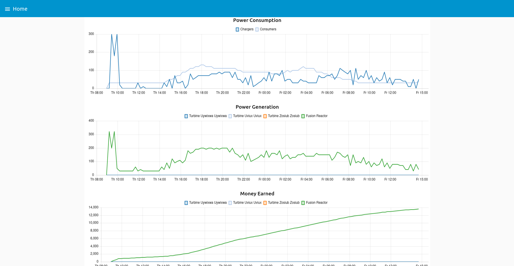
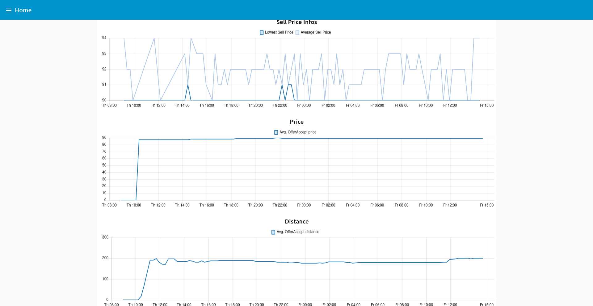
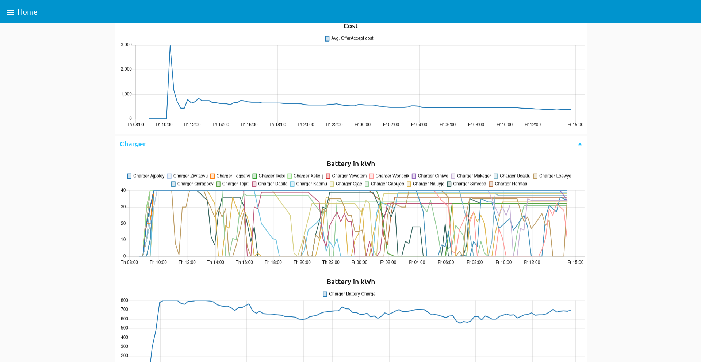

##### Random Offer

#### Scenario 3: Storm Breaks Turbines

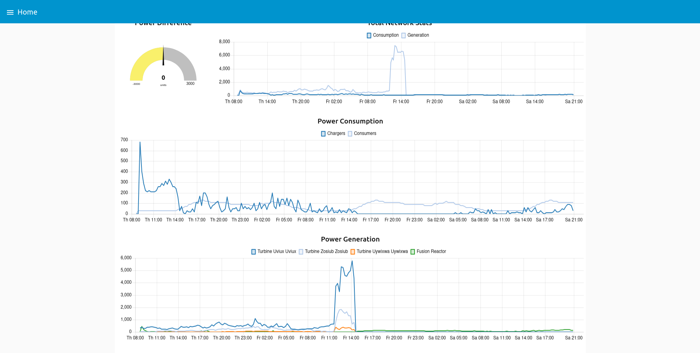

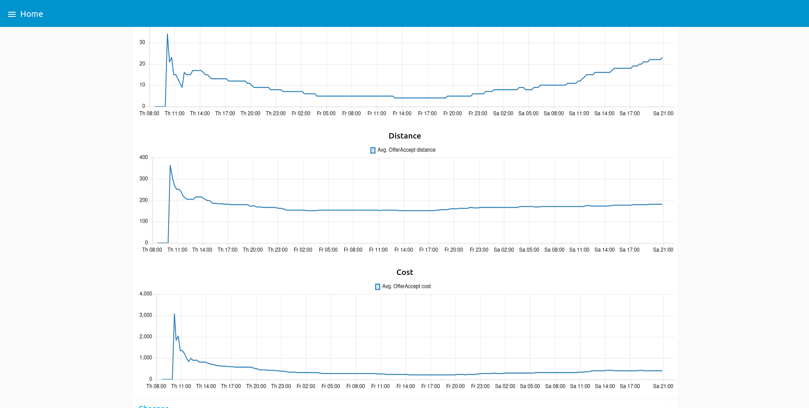
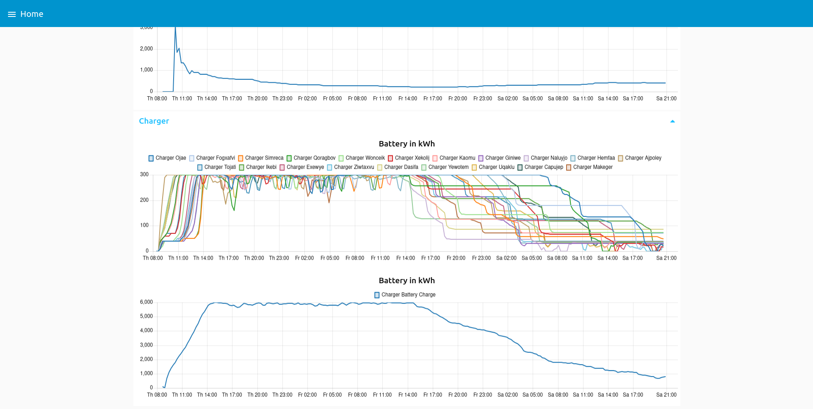

## 7. Conclusion and Outlook

We can see that the system works as intended, with the charging stations being able to reserve themselves based on the offers they receive from the electric vehicles. The power grid energy transfer works as expected, with the producers being able to sell their energy to the consumers based on the price they are willing to pay.

We can also see that the system is able to dynamically adapt to the current state of the power grid in case of component/turbine failures, such as the wind storm breaking all turbines.

Lastly, we can also see that charger prices and the algorithms by which the cars decide where to go can greatly influence the outcome of the simulation, as we can see in the results of the different scenarios.

## 8. Weaknesses of our System

1. Scalability: The system does not adapt well to massive amounts of agents, there are a lot of multicasts within the system that would start massively slowing down
2. Trust: The system does not have a trust mechanism, meaning that agents can lie about their offers and the system will not be able to detect it. If a charger offers a price of 0€, for example due to a bug, the vehicles would blindly trust it
3. "Stupid Ticks": There is one centralized architecture choice of tick phases, which makes sense for the grid itself, turbines and the communication with consumers and chargers work in a very "phased" way.
However, the communication between chargers and cars work on a completely different timescale which the tick phases do not properly reflect. If one would rewrite this project, it might make sense to not adhere to this.